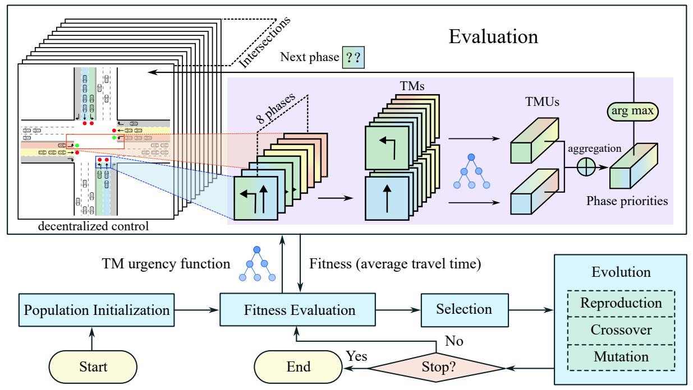

# Genetic Programming as An Explainable Alternative to Reinforcement Learning for Traffic Signal Control


[](https://arxiv.org/abs/2403.17328)
[](https://ieeexplore.ieee.org/document/11030860)
[](https://www.python.org/)


[](https://www.python.org/)
[](https://numpy.org/)
[](https://cityflow-project.github.io/)


---
This is a example code for paper `GPLight` "[Learning Traffic Signal Control via Genetic Programming](https://arxiv.org/abs/2403.17328)"
and paper `GPLight+` "[GPLight+: A Genetic Programming Method for Learning Symmetric Traffic Signal Control Policy](https://ieeexplore.ieee.org/document/11030860)"



> Evolving explainable policies using genetic programming, rather than learning non-transparent neural policies via deep reinforcement learning.

The testing platform for the algorithm is [CityFlow](https://cityflow-project.github.io/) and
`GPLight(+)` is adapted as an intelligent agent in [LibSignal](https://github.com/DaRL-LibSignal/LibSignal).

## Usage
This project does not have complex third-party dependencies!
### Download
Please execute the following command to install and configure our environment.
```shell
git clone https://github.com/Rabbytr/gplight.git
```
If you don't have Git on your computer, you can download the [zip](https://github.com/Rabbytr/gplight/archive/refs/heads/master.zip) file directly.

### Requirements
You can use pip to directly install the following dependencies.
```shell
pip install -r requirements.txt
```
```text
deap==1.4.1
numpy==2.0.0
libsumo==1.20.0
gym==0.26.2
pyyaml==6.0.1
pathos==0.3.2
```

To install CityFlow simulator:

> To ensure that CityFlow installs successfully, please make sure that [CMake](https://cmake.org/) is installed on your computer and C++ can be compiled on your computer

```shell
git clone https://github.com/cityflow-project/CityFlow.git
cd CityFlow
pip install -e .
```

> The [pybind11](https://github.com/pybind/pybind11) in source code of CityFlow is unfortunately a static version. If you encounter installation errors, you may consider upgrading the pybind11 version included in CityFlow.

### Run GPLight(+)

After installing the dependencies mentioned above, you can directly run `GPLight`.

```shell
python run_gplight.py --gplight
```
You can also run `GPLight+` using the same file
```shell
python run_gplight.py --gplight_plus
```

To quickly get feedback on running and keep you from getting bored :joy:, the parameters set in `run_gplight.py` are relatively small. 
Once the code runs correctly, please set appropriate parameters or those recommended in the paper.

## Citation :pray:
If you encounter any difficulty using our code, please do not hesitate to submit an issue or directly contact us! If you find our work helpful (or if you are so kind as to offer us some encouragement), please consider giving us a star, and citing our paper.
```text
@misc{liao2024learningtsc,
      title={Learning Traffic Signal Control via Genetic Programming}, 
      author={Xiao-Cheng Liao and Yi Mei and Mengjie Zhang},
      year={2024},
      eprint={2403.17328},
      archivePrefix={arXiv},
      primaryClass={cs.AI},
      url={https://arxiv.org/abs/2403.17328}, 
}

@article{liao2025gplightplus,
	title={GPLight+: A Genetic Programming Method for Learning Symmetric Traffic Signal Control Policy},
	author={Liao, Xiao-Cheng and Mei, Yi and Mengjie Zhang},
	journal={IEEE Transactions on Evolutionary Computation},
	year={2025},
	publisher={IEEE},
	url = {https://doi.org/10.1109/TEVC.2025.3578575}
}
```